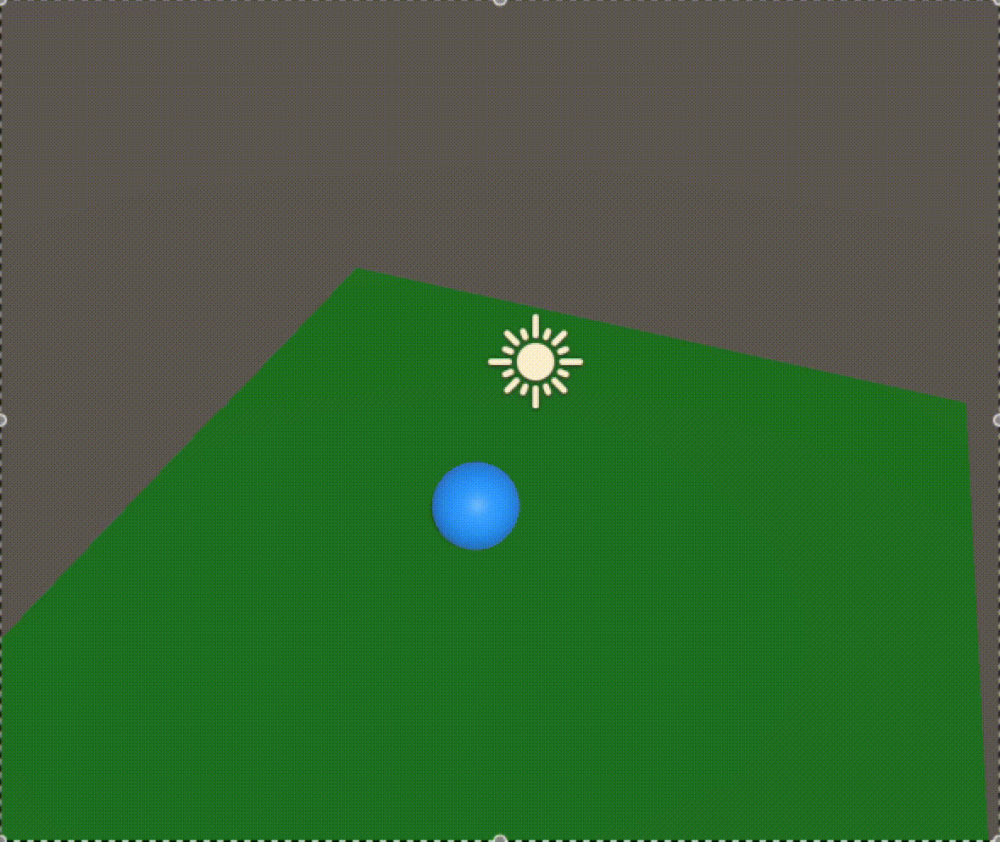
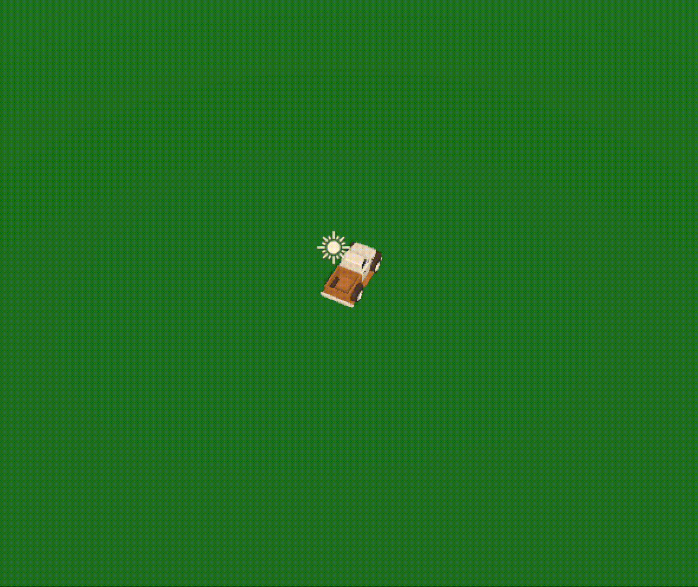

## Week 1
First week was used to set up the project and to get the basic movement and camera movement down. Decided that the movement would be a simple WASD control scheme and would allow for speeding up by pressing the Shift key.

  
   
  <strong>Basic Movement and Camera Follow Demo</strong>

Once this movement for both the player and camera were at a good baseline, I also started to find models that I would use throughout the project. I found this [Truck Model](https://assetstore.unity.com/packages/3d/vehicles/land/low-poly-mini-pickup-truck-244733) from the Unity asset store that I would use for the player. I also spent more time to refine movement to be more similar to a car including a slight tilt to the car when turning. When pressing Shift, I also increase the tilt.

  
   
  <strong>Car Movement Demo</strong>

## Week 2
Started this week with beginning the map and pop ups. The pop ups will be used in combination with the map, so that when a notable location is reached a pop up with corresponding text will also pop up. The map uses [Park Assets](https://assetstore.unity.com/packages/3d/environments/urban/low-poly-park-61922) found on the Unity asset store. After completing a basic park, I combined it with the main scene in order to have a very basic demo of the truck moving around an environment.

  
   
  <strong>Simple Demo</strong>

